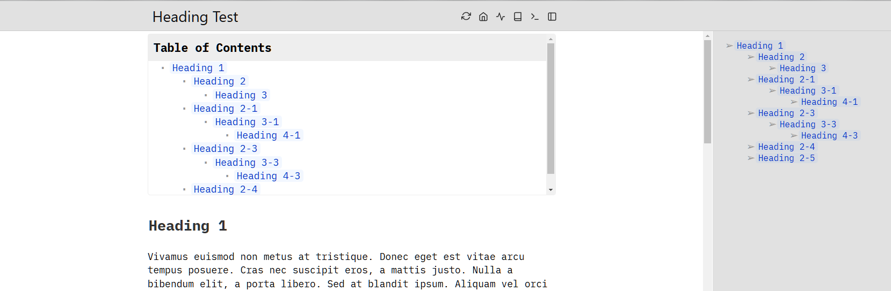
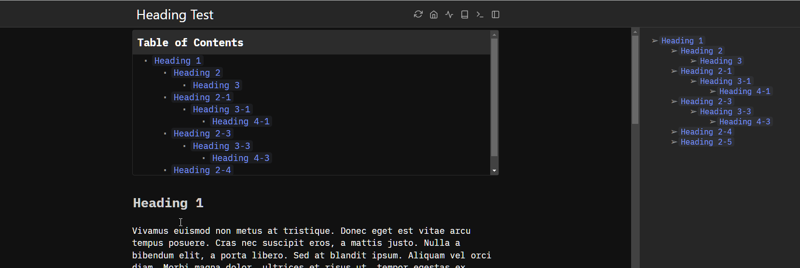

# SilverBullet Outline Sidebar

This plug will open a sidebar on the right of the window displaying the current pages headings in a list, clicking on the list will jump to that heading position




## Installation

If you would like to install this plug straight from Github, make sure you have the `.js` file committed to the repo and simply add

```yaml
- github:minusInfinite/outline-sidebar/outline-sidebar.plug.js
```

to your `PLUGS` file, run `Plugs: Update` command and off you go!

### Smooth scrolling

Add the following space-style to enable smooth scrolling and a smaller scrollbar

```css
div.cm-scroller {
  scroll-behavior: smooth;
  scrollbar-width: thin;
}
```

Adding this will now scroll smoothly when clicked.

## Commands

`Outline Sidebar: Tooggle` Toggle the sidebar open or close or with `Ctrl+Alt+o` or `Cmd+alt+o` on Mac

## To-do and known issues

- [ ] Colapsing the outline would a nice feature

- [x] Sidebar does remain open between page reloads but doesn't refresh the heading list when edited, saved or page change.

## Contributions

Raise an issue for any features you're interested in adding or an bugs you find and if you feel capable PRs are welcome.

### Build

To build this plug, make sure you have [SilverBullet installed with Deno](https://silverbullet.md/Install/Deno). Then, build the plug with:

```shell
deno task build
```

Or to watch for changes and rebuild automatically

```shell
deno task watch
```

Then, copy the resulting `.plug.js` file into your space's `_plug` folder. Or build and copy in one command:

```shell
deno task build && cp *.plug.js /my/space/_plug/
```

SilverBullet will automatically sync and load the new version of the plug, just watch the logs (browser and server) to see when this happens.
